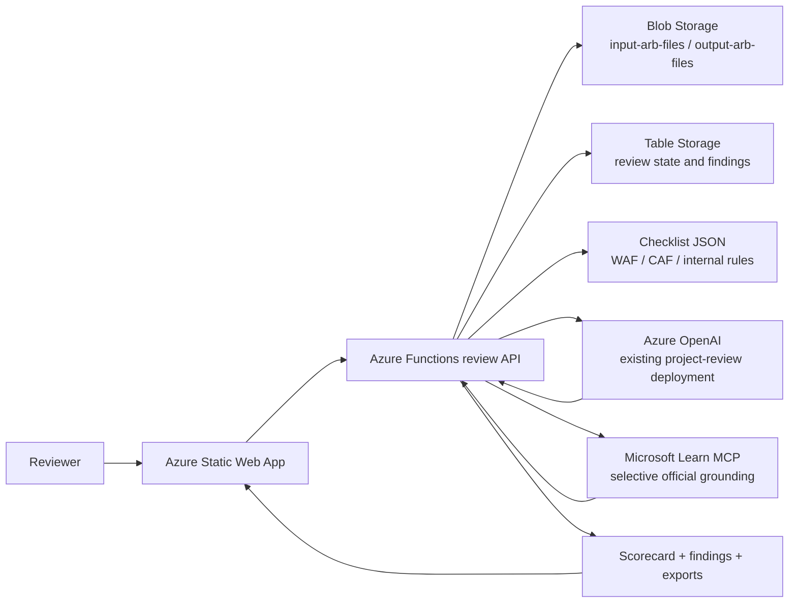

# ARB Agent Under 60 USD Architecture

## 1. Objective

This design adds an Architecture Review Board workflow to Azure Checklists while keeping the monthly operating target under 60 USD.

The design is optimized for:

- low fixed cost
- selective AI usage
- grounded Azure guidance
- deterministic scoring outside the model
- reuse of the current Azure OpenAI deployment already powering the public copilot

## 2. Design Decision

The lowest-risk, lowest-cost design is not a heavy multi-agent Foundry system.

It is a hybrid workflow:

- frontend upload and review orchestration in the existing app
- Azure Functions for extraction, normalization, scoring, and persistence
- Blob Storage for uploaded review files and generated outputs
- Table Storage for review state, findings, actions, and scorecards
- the current Azure OpenAI resource for summarization and board-style reasoning
- Microsoft Learn MCP used selectively for official Azure grounding when the review needs current Microsoft guidance
- internal checklist and rubric data stored as structured JSON under application control

## 3. Why This Fits the Budget

This design stays below the target because it avoids the highest fixed-cost services:

- no Azure AI Search Basic as a permanent dependency
- no default OCR pipeline
- no Foundry File Search storage charges as a baseline design
- no always-on containerized orchestration tier
- no multi-agent workflow fan-out

The only variable cost that should move meaningfully month to month is model token consumption.

## 4. Recommended Runtime Shape

## 5. Core Components

### Frontend

Reuse the current Next.js Static Web App and add an ARB review flow for:

- review creation
- file upload
- processing state
- findings view
- scorecard view
- exported report download

### Azure Functions

Functions own the durable logic:

- register reviews
- accept or broker uploads
- extract text from supported files
- map evidence to checklist rules
- compute scores deterministically
- call Azure OpenAI only for synthesis and board-quality narrative
- optionally call Microsoft Learn MCP for current Azure guidance

### Blob Storage

Use two containers:

- `input-arb-files`
- `output-arb-files`

Optional third container later:

- `arb-processing-cache`

### Table Storage

Persist lightweight state:

- review summary
- document inventory
- extracted evidence map
- findings
- actions
- scorecards
- decision history

### Azure OpenAI

Reuse the existing resource and deployment already validated in production:

- resource: `azreviewchecklistsopenaicu01`
- model family currently reported by health: `gpt-4.1-mini`

This keeps ARB reasoning aligned with the live environment and avoids another fixed-cost AI estate.

### Microsoft Learn MCP

Use Microsoft Learn MCP as a selective tool, not as the primary storage or retrieval layer.

Good use cases:

- validate latest Azure service guidance
- pull WAF and CAF references
- support reviewer-facing traceability to Microsoft sources

Bad use cases for the budget target:

- replacing internal rule storage
- repeated broad retrieval across every uploaded chunk

## 6. Review Flow

### Step 1. Create review

Capture:

- customer
- project
- target regions
- workload summary
- review type

### Step 2. Upload files

Support text-first document types first:

- PDF with extractable text
- DOCX
- PPTX
- TXT
- Markdown

Default rule:

- if a document is image-only or scan-heavy, mark it as limited-evidence unless the team later enables OCR as a premium option

### Step 3. Extract and normalize

Functions extract text and produce:

- document sections
- service mentions
- architecture statements
- assumptions
- risks
- missing evidence flags

### Step 4. Deterministic scoring

The application computes rubric scores from structured rules.

Model use should not decide the raw score on its own.

The model can help with:

- summarization
- grouping related findings
- writing board-quality narratives
- translating evidence into executive wording

### Step 5. Selective Microsoft grounding

Only when required, call Microsoft Learn MCP to verify or enrich:

- service-specific guidance
- WAF pillar guidance
- CAF operating model guidance
- official Azure positioning for the services in scope

### Step 6. Generate outputs

Write outputs to Blob Storage:

- Markdown review report
- JSON findings payload
- leadership summary
- remediation action list

## 7. Data Strategy

The under-60 design deliberately avoids a full search service as the default retrieval engine.

Use these layers instead:

### Internal rule layer

Store curated review content in the repo or storage as structured JSON:

- WAF categories
- CAF controls and expectations
- internal review checklist rules
- scoring weights
- evidence patterns

### Review evidence layer

Store extracted text and normalized evidence by review ID.

### Model context layer

Build a compact context package at runtime from:

- review metadata
- extracted evidence summary
- matched internal rules
- selective Microsoft Learn MCP results

This is cheaper than indexing everything into a permanent search tier.

## 8. Cost-Safe Defaults

To hold cost below 60 USD, keep these defaults:

- no OCR by default
- no Search Basic by default
- no Foundry File Search by default
- cap uploaded document size
- cap pages or extracted text per review
- summarize once, reuse many times
- cache Microsoft Learn grounding results by topic and date
- compute scores in code

## 9. Foundry Position

If the business still wants the label `ARB-AGENT` in Foundry, use a single lightweight Foundry agent only after the code-first path is working.

Recommended position:

- first ship the workflow using the current Azure OpenAI resource through Functions
- then optionally wrap the same instructions into one Foundry agent for operational consistency

Do not make Foundry-only features the critical path for the budget design.

## 10. Decision

The most effective under-60 architecture is:

- current Azure Static Web App
- current Azure Functions app
- Blob Storage
- Table Storage
- structured internal checklist JSON
- existing Azure OpenAI resource
- selective Microsoft Learn MCP grounding
- deterministic scoring in application code

This is the best tradeoff between cost, control, speed of implementation, and output quality.