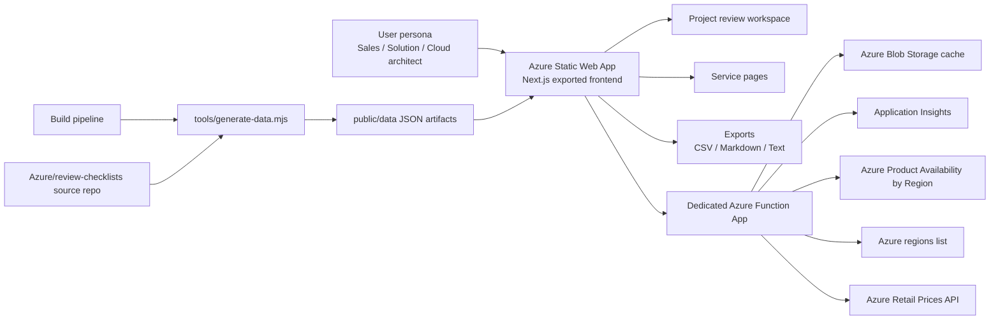

# Azure Checklists Architecture Design

## 1. Purpose

Azure Checklists is designed to help solution teams turn customer requirements into a scoped Azure review artifact.

The product should help a user answer five questions quickly:

1. Which Azure services are in the customer solution?
2. In which regions are those services available, restricted, preview, or unavailable?
3. What public retail pricing is published for those services across regions and SKUs?
4. Which checklist findings apply, do not apply, or should be excluded for this project?
5. Can the user export a clean design artifact for architecture, pre-sales, and engineering use?

## 2. Product Positioning

This product is not a generic AI assistant and not a static checklist browser.

It is a:

- project-scoped Azure solution review workspace
- region and cost validation tool
- checklist decision and design-note capture system
- export generator for architecture and pre-sales artifacts

## 3. Target Personas

### Sales Architect

- needs a first-pass view of service fit, region fit, and list pricing
- needs to move quickly from opportunity discussion to an exportable customer artifact

### Pre-sales / Solutions Architect

- needs to convert requirements into a scoped design review
- needs service-by-service notes, exclusions, and rationale

### Cloud Architect

- needs deeper checklist validation, traceability, and explicit applicability decisions
- needs a reusable project review record

### Cloud Engineer

- needs clarity on what is in scope and what findings are implementation-relevant

### Senior Director

- needs a fast, structured summary of selected services, regional constraints, pricing posture, and major review outcomes

## 4. Design Principles

### Project-first, not catalog-first

The user should start from a solution and then select the services that belong to it.

### Data-backed, not generic

Region fit and pricing should be grounded in Microsoft-backed sources and surfaced with clear freshness signals.

### Scoped, not global

Notes, applicability decisions, and exports should stay tied to a single project review.

### Fast to scan

The UI should prioritize scanability, matrix views, and short actions over dense explanatory copy.

### Export-ready

The outcome should be reusable in design documents, pricing sheets, and leadership material.

## 5. Functional Scope

### Core capabilities

- browse Azure services and checklist families
- create a named project review
- select only services in scope
- review service availability across regions
- review public retail pricing by service, region, SKU, and meter
- add project-specific checklist notes
- export scoped design notes and pricing artifacts

### Supporting capabilities

- backend health visibility
- low-cost cache-first data refresh
- local-first review persistence
- optional Azure-backed review storage

## 6. Solution Shape

The solution uses a static-first frontend with a dedicated backend for live commercial data.

## 7. Deployment Model

### Frontend

- Azure Static Web App
- Next.js static export
- static JSON catalog in `public/data`

### Backend

- dedicated Azure Function App
- Flex Consumption
- `512 MB`
- low instance count
- weekly timer refresh
- cache-first HTTP APIs

### Observability

- Application Insights
- `/api/health`
- cache state visibility

## 8. Data Model Strategy

### Static data

Generated during build:

- catalog summary
- service index
- family pages
- service pages
- checklist normalization output

### Runtime data

Loaded through the Function App:

- live regional availability
- restricted / early-access region states
- live retail pricing
- cache health and freshness

### User-authored data

Stored first in browser storage:

- active project review
- selected services
- service assumptions
- checklist notes
- applicability decisions

Optionally mirrored later to Azure-backed storage.

## 9. Review Workflow

1. User starts a project review.
2. User captures audience, business scope, and target regions.
3. User adds Azure services in scope.
4. User uses the region + cost + checklist matrix to assess readiness.
5. User opens service pages and records item-level project notes.
6. User exports only the scoped services and their notes.

## 10. Why This Is Better Than A Generic AI Tool

Generic AI can answer Azure questions, but it does not naturally provide:

- project-scoped memory
- deterministic exports
- explicit include / not-applicable / exclude decisions
- cross-service matrix views
- live pricing and region-fit tied to selected services
- reusable design-document output

Azure Checklists becomes better than a generic AI tool when it behaves like a working system instead of a general Q&A surface.

## 11. Non-Functional Requirements

### Cost posture

- static-first frontend
- low-cost Function App
- timer-trigger warm refresh
- cache-first API calls

### Trust posture

- visible data health
- live-source traceability
- no fake pricing placeholders

### Performance

- static catalog rendering
- region/pricing requests only for selected services
- browser cache for repeated service lookups

### Extensibility

- room for future copilot features
- room for Azure-backed persistence
- room for quantity-based commercial modeling

## 12. Immediate Architectural Priorities

1. Keep the project review flow as the main product path.
2. Expand the matrix into the default working surface.
3. Preserve the dedicated Function App trust model.
4. Add quantity and usage assumptions after the region/cost baseline is stable.
5. Add an assistive project-review copilot only after the workflow is already intuitive without it.
