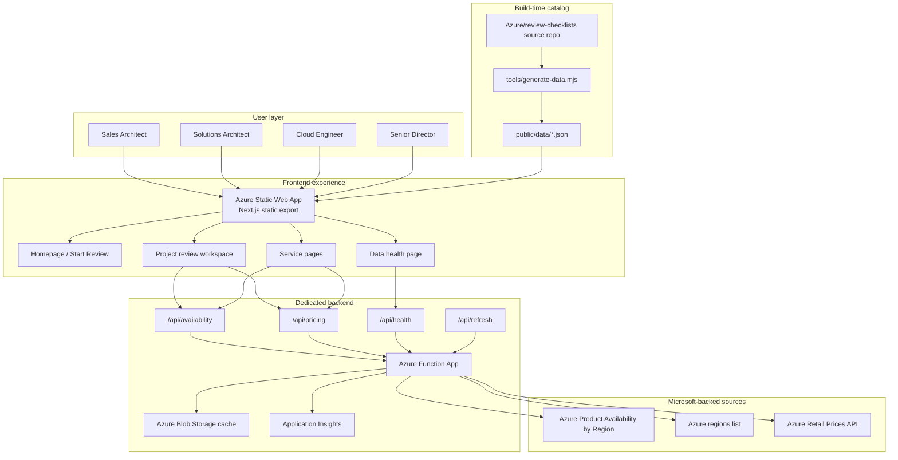
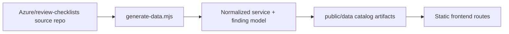
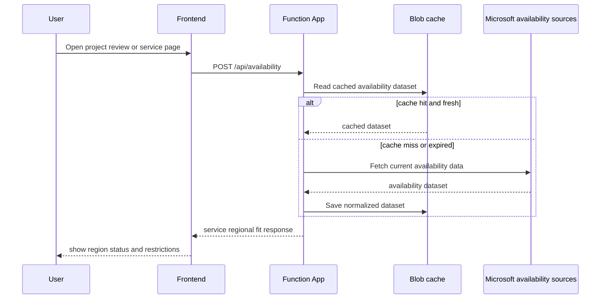
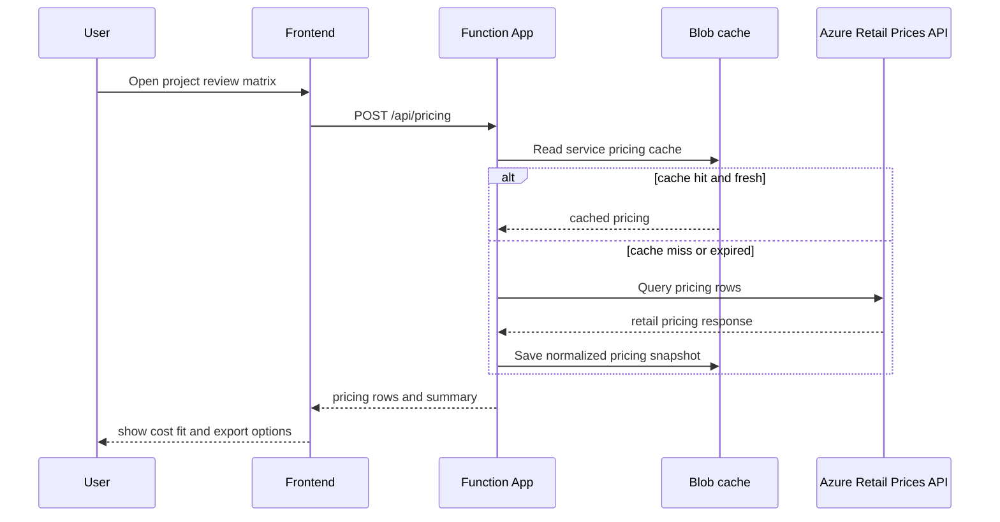
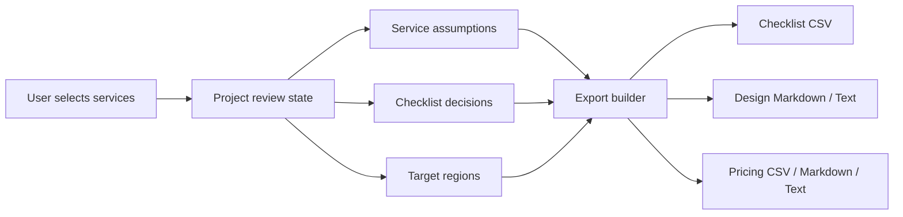

# Architecture Diagram

## End-to-end solution architecture

## Primary data flows

## 1. Build-time catalog flow

## 2. Live regional availability flow

## 3. Live pricing flow

## 4. Project review export flow

