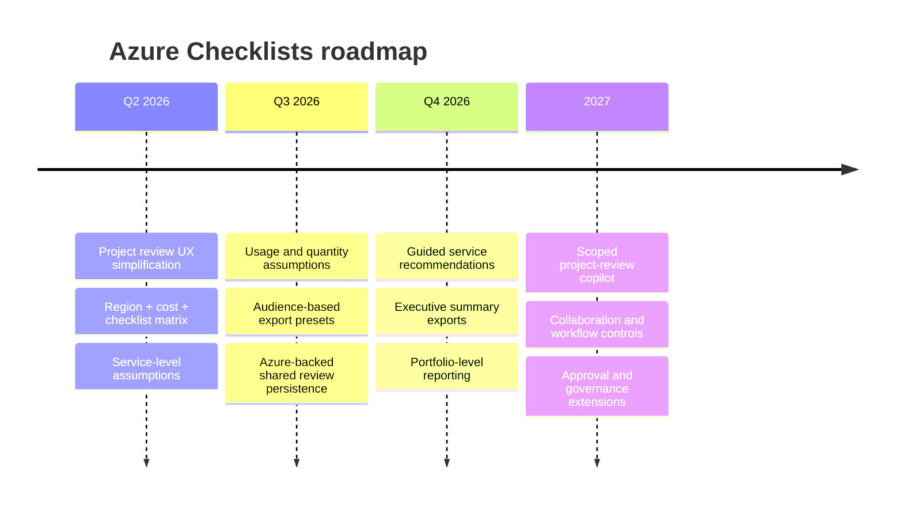

# Future Roadmap

## Roadmap summary

## Delivery phases

## Phase 1. Foundation delivered

- project review workspace
- selected services per project review
- item-level include / not-applicable / exclude decisions
- dedicated Function App for live availability, pricing, and health
- scoped checklist and pricing exports

## Phase 2. Productivity next

- usage and quantity assumptions
- estimated monthly cost rollups
- better service and export presets by audience
- clearer summary cards for leadership review

## Phase 3. Shared review operations

- Azure-backed persisted project reviews
- optional sign-in
- shared handoff between architecture and engineering teams
- saved export history

## Phase 4. Assisted intelligence

- scoped project-review copilot
- grounded design-summary generation
- region and pricing explanation assistance
- auto-drafting of not-applicable rationale

## Phase 5. Governance expansion

- governance reporting across projects
- approval workflow and status tracking
- richer review lineage and audit support

## Prioritization lens

Use this order for decision-making:

1. make the core workflow easier
2. improve export usefulness
3. improve pricing and regional accuracy
4. improve shared persistence
5. add AI assistance only after the workflow is already strong

## Success metrics by phase

| Phase | Main success metric |
| --- | --- |
| Foundation | number of complete project-review exports |
| Productivity | time from project creation to first export |
| Shared review | number of reused / revisited saved reviews |
| Assisted intelligence | reduced authoring time for notes and summaries |
| Governance | leadership visibility across project portfolio |
