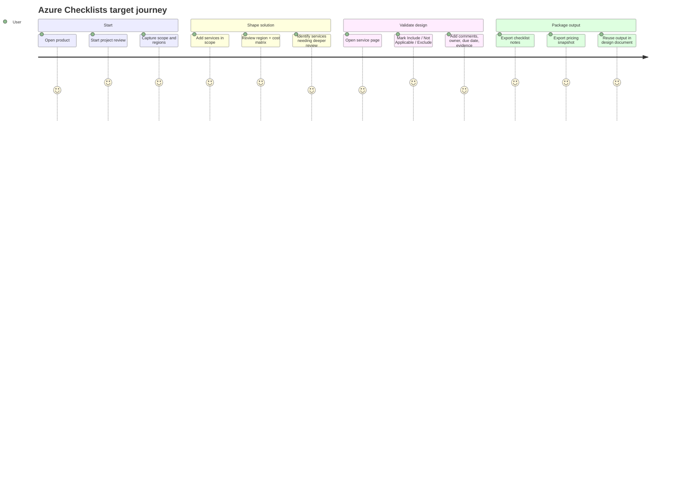

# Journey Map

## Current target journey

## Detailed journey

| Stage | User goal | Current product support | Friction to reduce | Better future state |
| --- | --- | --- | --- | --- |
| Discover | Understand what the product is for | improved homepage and project-first message | still more content than needed on first visit | start review as the dominant CTA |
| Scope | Create one customer/project boundary | project review page supports audience, scope, target regions | the mental model can still feel like an internal package | rename and simplify everywhere around project review |
| Select services | keep only relevant services | selected service workflow exists | users may still browse too broadly before selecting | tighter add-service flow from homepage and services list |
| Validate region fit | know what can deploy where | live availability and restriction flags exist | users need the matrix sooner and more prominently | make matrix the main working surface |
| Validate cost fit | understand first-pass list pricing | live pricing exists and exports are available | pricing is still meter-heavy for some users | add guided assumptions and summarized rollups |
| Decide findings | capture design rationale | item drawer supports notes and package decisions | still requires detail-view navigation | faster inline review links and service summaries |
| Export | create a usable artifact | checklist and pricing exports are scoped | user still chooses between several formats with little guidance | add audience-based export presets |

## Journey design goals

1. First value within the first minute.
2. One obvious next action at each stage.
3. One scoped project review as the primary unit of work.
4. Matrix-first decision making before deep findings.
5. Clear export outcomes for each persona.
