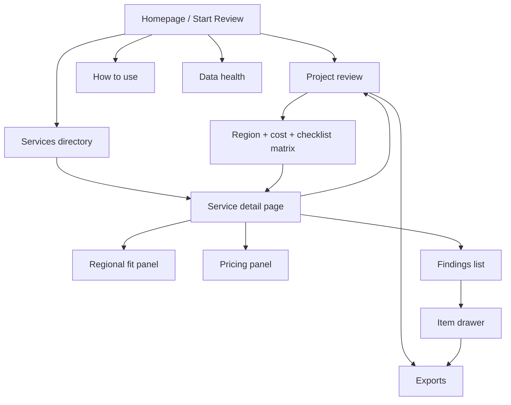

# Product Map

## Product surface map

## Product modules

| Module | User purpose | Main implementation |
| --- | --- | --- |
| Homepage | explain value and start a review | `src/components/dashboard-home.tsx` |
| Project review | create scoped review and export outputs | `src/components/review-package-workbench.tsx` |
| Services directory | browse and add services | `src/components/services-directory.tsx` |
| Service detail | review region, cost, and findings for one service | `src/components/service-page-view.tsx` |
| Item drawer | capture item-level design notes | `src/components/item-drawer.tsx` |
| Data health | show backend/data trust posture | `src/components/data-health-view.tsx` |

## API map

| API | Purpose | Backend file |
| --- | --- | --- |
| `/api/availability` | service-by-region fit | `api/src/functions/service-regional-fit.js` |
| `/api/pricing` | service pricing by rows, SKUs, and locations | `api/src/functions/service-pricing.js` |
| `/api/health` | backend status and cache health | `api/src/functions/health.js` |
| `/api/refresh` | admin-triggered warm refresh | `api/src/functions/commercial-refresh.js` |
| `/api/review-records` | optional persisted review save/load | `api/src/functions/review-records.js` |
| `/api/review-records-export` | optional persisted review export | `api/src/functions/review-records-export.js` |

## Output map

| Output | Audience | Why it matters |
| --- | --- | --- |
| Checklist CSV | architecture and engineering follow-up | structured action tracking |
| Design Markdown | architects and pre-sales | easy to embed in design documents |
| Plain text notes | lightweight handoff | quick reuse in email, tickets, or notes |
| Pricing CSV | pre-sales and commercial shaping | first-pass pricing workbook |
| Pricing Markdown / text | leadership summaries and design appendices | readable commercial snapshot |

## Product boundaries

### In scope

- project-scoped review workspace
- live availability and pricing
- static-first catalog and findings
- local-first review state
- exportable artifacts

### Out of scope for now

- full multi-user collaboration
- evidence document upload
- approval workflow engine
- contract-specific pricing
- broad conversational AI as the primary interface
