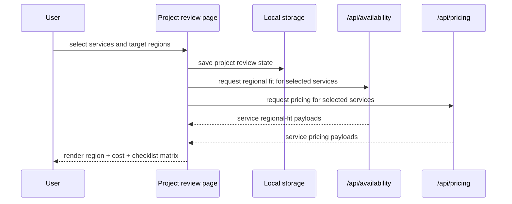
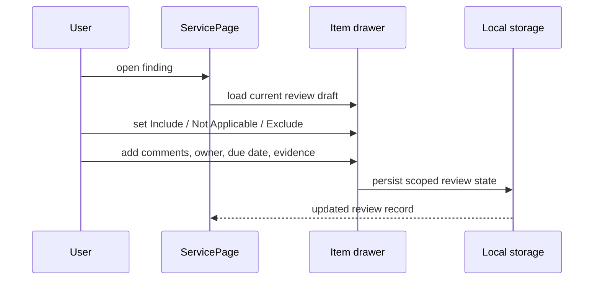
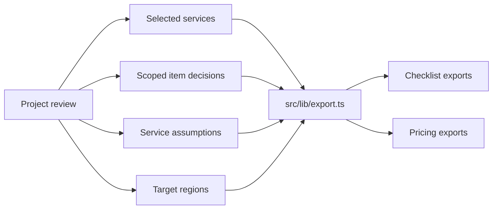

# Exact Technical Implementation Design

## 1. Objective

This document describes the exact implementation design for the current Azure Checklists solution as it exists in this repository and how the major parts work together.

## 2. Repository structure

| Area | Purpose | Key files |
| --- | --- | --- |
| `app/` | Next.js app routes and global styling | `app/page.tsx`, `app/review-package/page.tsx`, `app/services/[slug]/page.tsx`, `app/data-health/page.tsx`, `app/globals.css` |
| `src/components/` | UI modules and workflow surfaces | `dashboard-home.tsx`, `review-package-workbench.tsx`, `service-page-view.tsx`, `service-pricing-panel.tsx`, `service-regional-fit.tsx`, `item-drawer.tsx`, `data-health-view.tsx` |
| `src/lib/` | frontend data loading, storage, export logic | `catalog.ts`, `review-storage.ts`, `export.ts`, `service-pricing.ts`, `service-regional-fit.ts`, `review-cloud.ts` |
| `src/types.ts` | shared frontend type model | `src/types.ts` |
| `tools/` | build-time data generator | `tools/generate-data.mjs` |
| `api/src/functions/` | Azure Functions HTTP and timer entry points | `service-pricing.js`, `service-regional-fit.js`, `health.js`, `commercial-refresh.js`, `review-records.js` |
| `api/src/shared/` | backend shared services and storage helpers | `availability-service.js`, `service-pricing.js`, `commercial-cache.js`, `azure-live-data.js`, `storage.js` |
| `scripts/` | deployment automation | `deploy-dedicated-function-backend.ps1` |

## 3. Frontend implementation

## 3.1 Routes

| Route | Purpose | Primary component |
| --- | --- | --- |
| `/` | homepage and product positioning | `src/components/dashboard-home.tsx` |
| `/review-package` | project review workspace | `src/components/review-package-workbench.tsx` |
| `/services` | service directory | `src/components/services-directory.tsx` |
| `/services/[slug]` | service detail page | `src/components/service-page-view.tsx` |
| `/technologies/[slug]` | family detail page | `src/components/technology-page-view.tsx` |
| `/explorer` | advanced full-catalog exploration | `src/components/explorer-client.tsx` |
| `/data-health` | backend health and trust view | `src/components/data-health-view.tsx` |

## 3.2 Frontend state model

The frontend uses a local-first state model.

### Persistent local state

Stored in browser `localStorage` by `src/lib/review-storage.ts`:

- active theme
- explorer filters
- active project review id
- all project reviews
- scoped project review notes

### Project review record

Implemented in `src/types.ts` and `src/lib/review-storage.ts`.

Important fields:

- `id`
- `name`
- `audience`
- `businessScope`
- `targetRegions`
- `selectedServiceSlugs`
- `serviceAssumptions`
- `createdAt`
- `updatedAt`

### Item-level review draft

Important fields:

- `reviewState`
- `packageDecision`
- `comments`
- `owner`
- `dueDate`
- `evidenceLinks`
- `exceptionReason`

## 3.3 Project review workflow implementation

Implemented mainly in `src/components/review-package-workbench.tsx`.

### Current workflow stages

1. create project review
2. add services
3. review region + cost + checklist matrix
4. open service pages and record notes
5. export scoped artifacts

### Matrix behavior

Each selected service is rendered as one row with:

- service summary
- region-fit chips
- cost-fit chips
- checklist progress chips
- design assumptions

### Service assumptions

Stored per service slug:

- `plannedRegion`
- `preferredSku`
- `sizingNote`

## 3.4 Service detail implementation

Implemented mainly in `src/components/service-page-view.tsx`.

The service detail page combines:

- active project review context
- service addition to project review
- live regional fit panel
- live pricing panel
- findings list
- item drawer for decisions and notes

The service detail page is currently the place where detailed checklist review happens.

## 3.5 Export implementation

Implemented in `src/lib/export.ts`.

### Export outputs

- scoped checklist CSV
- design Markdown
- plain text notes
- pricing CSV
- pricing Markdown
- pricing text

### Export input model

Exports combine:

- active project review metadata
- selected services
- item-level decisions
- service assumptions
- target regions
- live pricing snapshots

## 4. Build-time data implementation

Build-time catalog generation is implemented in `tools/generate-data.mjs`.

### Responsibilities

- read the upstream review-checklists repository
- normalize sparse and inconsistent source fields
- emit service and technology index artifacts
- emit catalog JSON used by static routes

### Output location

- `public/data`

These artifacts enable:

- static homepage summaries
- static services directory
- static family/service routes
- fast initial load without live backend dependency

## 5. Backend implementation

## 5.1 Deployment shape

The backend is a dedicated Azure Function App deployed separately from the frontend and linked to the Azure Static Web App.

Provisioning is automated in:

- `scripts/deploy-dedicated-function-backend.ps1`

### Current intended configuration

- Azure Function App
- Flex Consumption
- `512 MB`
- low maximum instance count
- HTTPS only
- Application Insights enabled
- Blob Storage-backed cache

## 5.2 Function endpoints

### `/api/availability`

Entry point:

- `api/src/functions/service-regional-fit.js`

Responsibilities:

- accept a batch of selected services
- load cached availability data or refresh if needed
- map service offerings to Microsoft availability data
- return:
  - available regions
  - unavailable regions
  - restricted and early-access status
  - preview and retiring summaries
  - global-service signals

### `/api/pricing`

Entry point:

- `api/src/functions/service-pricing.js`

Responsibilities:

- accept a batch of selected services
- load cached pricing snapshots or query fresh pricing
- return:
  - mapping status
  - pricing rows
  - SKU counts
  - meter counts
  - billing location counts
  - target-region match counts
  - starting retail price

### `/api/health`

Entry point:

- `api/src/functions/health.js`

Responsibilities:

- show backend mode
- show storage and Insights configuration
- show refresh schedule
- show availability and pricing cache state

### `/api/refresh`

Entry point:

- `api/src/functions/commercial-refresh.js`

Responsibilities:

- manual admin-triggered refresh
- optional refresh key check
- refresh availability cache
- refresh a warm subset of pricing entries

### Timer refresh

Entry point:

- `api/src/functions/commercial-refresh.js`

Responsibilities:

- scheduled weekly refresh
- warm availability data
- optionally warm a subset of pricing data

## 5.3 Backend shared services

| File | Responsibility |
| --- | --- |
| `api/src/shared/availability-service.js` | load and warm availability dataset |
| `api/src/shared/service-pricing.js` | query and normalize pricing data |
| `api/src/shared/azure-live-data.js` | parse and normalize Microsoft availability source content |
| `api/src/shared/commercial-cache.js` | cache state, TTLs, refresh status |
| `api/src/shared/storage.js` | Blob Storage access |
| `api/src/shared/review-records.js` | optional persisted review storage |
| `api/src/shared/auth.js` | common API response helpers |

## 6. Data sources

### Build-time source

- Azure review checklist source repository

### Runtime sources

- Azure Product Availability by Region
- Azure regions list
- Azure Retail Prices API

## 7. End-to-end flows

## 7.1 Project review matrix flow

## 7.2 Item note capture flow

## 7.3 Export flow

## 8. Azure resource design

| Resource | Purpose | Cost posture |
| --- | --- | --- |
| Azure Static Web App | frontend hosting | fixed, low operational overhead |
| Azure Function App | live APIs and scheduled refresh | low with Flex Consumption |
| Storage Account | cache and optional review persistence | low |
| Application Insights | telemetry and health visibility | controlled by sampling and caps |

## 9. Key configuration

Configured through the Function App settings, including:

- `AZURE_STORAGE_CONNECTION_STRING`
- `AZURE_STORAGE_REVIEW_CONTAINER_NAME`
- `AZURE_STORAGE_REVIEW_ARTIFACT_CONTAINER_NAME`
- `AZURE_STORAGE_COMMERCIAL_CACHE_CONTAINER_NAME`
- `AZURE_COMMERCIAL_REFRESH_SCHEDULE`
- `AZURE_COMMERCIAL_CACHE_TTL_HOURS`
- `AZURE_AVAILABILITY_CACHE_TTL_HOURS`
- `AZURE_PRICING_CACHE_TTL_HOURS`
- `AZURE_COMMERCIAL_WARM_SERVICE_INDEX_URL`
- `AZURE_COMMERCIAL_WARM_SERVICE_LIMIT`
- `AZURE_COMMERCIAL_REFRESH_KEY`

## 10. Immediate implementation improvements

### UX

- reduce remaining package terminology where users see it
- strengthen the project review matrix as the main surface
- add audience-based export presets

### Commercial modeling

- add quantity and usage assumptions per selected service
- add basic monthly rollups while keeping meter traceability

### Trust

- keep Data Health visible
- expose freshness timestamps wherever live data is shown

### Assistance

- if AI is added later, keep it as a scoped project-review copilot, not a generic floating chat widget

## 11. Technical guardrails

1. Do not replace live pricing with fake static values.
2. Do not treat restricted regions as simply unavailable.
3. Do not mix project-review notes across packages.
4. Do not collapse complex pricing into a misleading single monthly number without assumptions.
5. Do not move the frontend away from the static-first delivery model unless scale or interactivity demands it.
