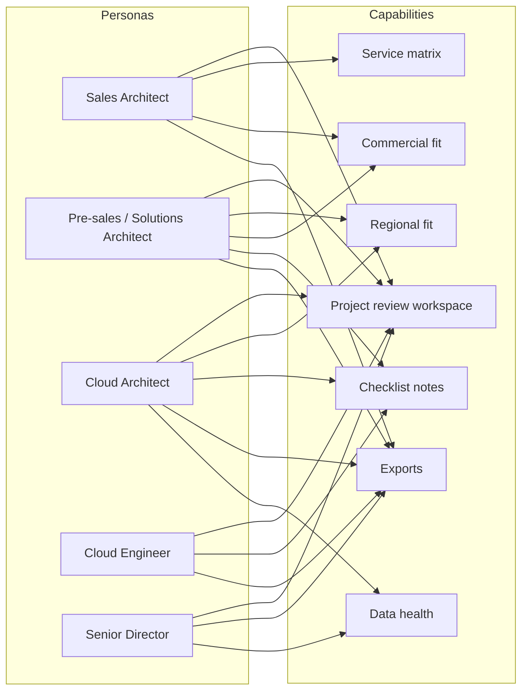

# User Service Map

## Persona to service-value map

| Persona | Main question | Key product surface | Data needed | Output expected |
| --- | --- | --- | --- | --- |
| Sales Architect | Can this service mix support the customer proposal? | Project review matrix | region fit, list pricing, scoped services | pricing snapshot, scoped service list |
| Pre-sales Architect | What belongs in the first design draft? | Project review + service pages | service fit, checklist findings, region restrictions | design notes, review export |
| Solutions Architect | Which checklist items apply to this design? | Service page + item drawer | findings, source traceability, package decisions | architecture rationale, review notes |
| Cloud Architect | Is the design technically sound and regionally viable? | Service detail + matrix + export | availability, pricing, checklist context | design review pack |
| Cloud Engineer | What needs to be implemented or validated? | Service findings + project notes | included items, owner, due date, evidence | implementation-focused checklist |
| Senior Director | What is the service posture, cost posture, and risk posture? | Project review summary + exports | selected services, target regions, summary notes | leadership summary |

## User-to-capability service map

## Service-value map

### Project review workspace

- anchors the user in a single project scope
- prevents notes from bleeding between customer solutions

### Region + cost matrix

- becomes the fastest working surface for sales, pre-sales, and architecture roles
- provides one-screen understanding of scoped services

### Service detail

- supports deeper design review
- lets users justify inclusion, exclusion, or non-applicability

### Export layer

- turns the product from a browser into a working system

### Data health

- provides trust and operational transparency
