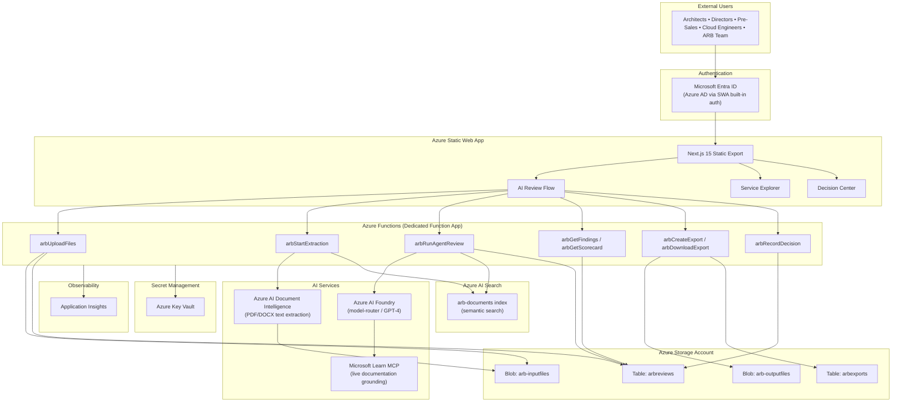

> **Cost note (2026-04-29):** Both pilot ($25–60/month) and production ($500–700/month) deployment tiers exist. The authoritative breakdown is [`internal/cost-narrative-reconciliation-2026-04-29.md`](./internal/cost-narrative-reconciliation-2026-04-29.md).

# Azure Review Assistant — Product Documentation

**Version:** 1.0  
**Last Updated:** April 2026  
**Classification:** Internal — Microsoft Leadership, Partners, and Stakeholders  
**Product URL:** https://jolly-sea-014792b10.6.azurestaticapps.net

---

## Table of Contents

1. [Executive Summary](#1-executive-summary)
2. [Product Purpose and Vision](#2-product-purpose-and-vision)
3. [Architecture Overview](#3-architecture-overview)
4. [Azure Services Used](#4-azure-services-used)
5. [How to Use the Website](#5-how-to-use-the-website)
   - 5.1 [Creating a New Review](#51-creating-a-new-review)
   - 5.2 [Running the Assessment](#52-running-the-assessment)
   - 5.3 [Reviewing Findings](#53-reviewing-findings)
   - 5.4 [Reviewing the Scorecard](#54-reviewing-the-scorecard)
   - 5.5 [Recording a Decision](#55-recording-a-decision)
   - 5.6 [Exporting the Review Package](#56-exporting-the-review-package)
   - 5.7 [Service Explorer (No Sign-in Required)](#57-service-explorer-no-sign-in-required)
6. [Assessment Domains](#6-assessment-domains)
7. [Data Flow and Processing Pipeline](#7-data-flow-and-processing-pipeline)
8. [Security and Compliance](#8-security-and-compliance)
9. [Six-Month Development Roadmap](#9-six-month-development-roadmap)
10. [Technology Stack](#10-technology-stack)
11. [Cost Estimate (Development Phase)](#11-cost-estimate-development-phase)

---

## 1. Executive Summary

Azure Review Assistant is an AI-powered platform that automates the architecture review process for Azure cloud projects. It replaces manual, fragmented review work — spreadsheets, checklists, emails, and consultant engagements — with a structured, evidence-based workflow that produces board-ready findings in minutes.

**Core value proposition:** Upload your architecture documents (SOW, HLD, LLD, diagrams), and the platform evaluates them against the Azure Well-Architected Framework (WAF), Cloud Adoption Framework (CAF), Azure Landing Zone (ALZ) standards, and service-specific Microsoft Learn best practices. The output is a scored, traceable review package with findings, a weighted scorecard, and an executive recommendation — ready for Architecture Review Board presentation.

**Who it serves:** Azure Architects, ARB Members, Pre-Sales Architects, Cloud Engineers, and Senior Directors who need structured, repeatable architecture reviews without the overhead of manual checklist work.

### Key Differentiators

| Alternative | Limitation | Azure Review Assistant Advantage |
|---|---|---|
| **Azure Advisor** | Only analyses deployed resources; cannot review design documents before deployment | Reviews architecture documents pre-deployment, catching gaps before infrastructure is provisioned |
| **WAF Assessment Tool** | Self-service questionnaire — the user must know the right answers | Reads your documents and identifies gaps automatically; no questionnaire to fill in |
| **External Consultants** | Expensive, slow (days to weeks), inconsistent quality, limited availability | Available 24/7, consistent quality, completes in minutes, fraction of the cost |
| **Generic GPT / Copilot** | No project memory, no structured output, no framework coverage guarantee, no traceability | Purpose-built system prompt covering all Microsoft frameworks, MCP-grounded in live docs, structured scorecard output, findings saved to your account |

In short: Azure Review Assistant is an AI ARB member that never sleeps, never misses a checklist item, and hands you a board-ready pack in minutes.

---

## 2. Product Purpose and Vision

### Mission

Turn customer requirements and architecture documents into a scoped, traceable Azure review artifact — faster and more consistently than any manual process.

### The Two Hero Features

**1. Document-Based AI Review (Sign-in Required)**

Upload your design documents — SOW, HLD, LLD, architecture diagrams — and the AI agent reads them, evaluates them against WAF + CAF + ALZ + HA/DR + Security + Networking + Monitoring frameworks, and produces:
- Scored findings with severity, domain, framework reference, and evidence basis
- A weighted scorecard across 8 dimensions
- An executive recommendation (Approved / Needs Revision / Rejected)
- Exportable review packages in Markdown, CSV, and HTML

All findings are grounded in live Microsoft Learn documentation via the Microsoft Learn MCP server — not stale training data.

**2. Service-Level Findings (No Sign-in Required)**

Browse 100+ Azure services, pick your stack, and get immediate WAF, CAF, and ALZ findings with direct links to Microsoft Learn. No AI processing needed, no sign-in required. Useful for quick scoping before committing to a full design review.

### Target Personas

| Persona | Primary Need |
|---|---|
| **Azure Architects** | Structured WAF/CAF/ALZ review in minutes, not days |
| **ARB Members** | Upload SOW/design docs → AI reviews against all frameworks → scorecard + findings ready for the board |
| **Pre-Sales Architects** | Quick scoping before committing to a full design; exportable customer artifact |
| **Cloud Engineers** | Self-service checklist validation before presenting to leadership |
| **Senior Directors** | Executive summary + recommendation (Approved / Needs Revision) without reading 100-page documents |

### Value Delivered

| Without Azure Review Assistant | With Azure Review Assistant |
|---|---|
| ARB review takes 2–3 days of manual work | Agent review completes in minutes |
| Findings live in emails and spreadsheets | Everything in one place, exportable as CSV / HTML / Markdown |
| Reviewer may miss ALZ or HA/DR checks | All framework areas checked every single time |
| Output needs reformatting for each audience | Export as executive summary, action list, or full ARB pack |
| 7-day file retention managed manually | Auto-deleted, no data hoarding risk |

---

## 3. Architecture Overview

### High-Level Architecture Diagram

### Component Summary

| Layer | Service | Technology | Purpose |
|---|---|---|---|
| **Frontend** | Azure Static Web App | Next.js 15, React 19, TypeScript 5 | User interface — file upload, findings display, scorecard, exports |
| **Backend** | Azure Functions (Dedicated Function App) | Node.js 22, Azure Functions v4 | Upload, extraction, AI orchestration, CRUD, export generation |
| **Storage** | Azure Blob Storage | Hot tier, Standard LRS | Uploaded documents (`arb-inputfiles`), generated exports (`arb-outputfiles`) |
| **Metadata** | Azure Table Storage | NoSQL key-value | Review metadata, findings, scorecard, actions, exports, decisions |
| **Search** | Azure AI Search | Semantic search with `en.microsoft` analyser | Document chunk indexing and retrieval-augmented generation (RAG) |
| **AI Engine** | Azure AI Foundry | GPT-4 via model-router, chat completions | Core assessment engine — evaluates documents against WAF/CAF/ALZ |
| **Grounding** | Microsoft Learn MCP | HTTP REST | Real-time Microsoft documentation for evidence grounding |
| **Extraction** | Azure AI Document Intelligence | prebuilt-layout model | PDF, DOCX, PPTX text and table extraction |
| **Auth** | Microsoft Entra ID | Azure AD via SWA built-in auth | Authentication for all review operations |
| **Secrets** | Azure Key Vault | Standard tier | API keys, connection strings, credentials |
| **Monitoring** | Application Insights | Instrumentation SDK | Function execution metrics, errors, latency tracking |

---

## 4. Azure Services Used

| Service | Purpose | SKU / Tier | Region | Notes |
|---|---|---|---|---|
| **Azure Static Web Apps** | Frontend hosting — Next.js 15 static export with global CDN | Free tier | Global (edge) | Linked to dedicated Function App backend; Azure AD auth built-in |
| **Azure Functions** | Backend API — upload, extraction, AI orchestration, CRUD, exports | Flex Consumption | UK South | Dedicated Function App; Node.js 22; 512 MB instance memory |
| **Azure Table Storage** | Review metadata, findings, scorecard, actions, exports, decisions | Standard LRS (part of Storage Account) | UK South | Tables: `arbreviews`, `arbexports`; partition key = reviewId |
| **Azure Blob Storage** | Uploaded documents and generated export artifacts | Standard LRS Hot tier | UK South | Containers: `arb-inputfiles` (uploads), `arb-outputfiles` (exports); private access only |
| **Azure AI Foundry** | AI assessment engine — chat completions with structured system prompt | Pay-per-token (model-router) | UK South / East US | Model: GPT-4; comprehensive WAF/CAF/ALZ system prompt; 8192 max tokens |
| **Azure AI Search** | Document chunk indexing and semantic search for RAG | Basic or Standard tier | UK South | Index: `arb-documents`; semantic ranking with `en.microsoft` analyser |
| **Azure AI Document Intelligence** | PDF, DOCX, PPTX text and table extraction | S0 (Standard) | UK South | Model: `prebuilt-layout`; extracts text, tables, key-value pairs, structure |
| **Azure OpenAI (via Foundry)** | Chat completions for assessment and image description | Pay-per-token | UK South / East US | Accessed through Azure AI Foundry model-router endpoint |
| **Application Insights** | Monitoring, telemetry, error tracking, performance metrics | Pay-as-you-go | UK South | Connected to Function App; tracks execution time, error rates, latency |
| **Azure Key Vault** | Secret management — API keys, connection strings, credentials | Standard | UK South | Optional but recommended; RBAC-enabled; 90-day key rotation policy |
| **Microsoft Entra ID (Azure AD)** | Authentication — user sign-in for review operations | N/A (platform service) | Global | Configured via Static Web Apps built-in auth; supports `authenticated` and `admin` roles |

---

## 5. How to Use the Website

### 5.1 Creating a New Review

1. **Sign in** with your Microsoft account via the Azure AD prompt. Authentication is required for all review operations.
2. Navigate to the **AI Review** section from the homepage or navigation.
3. **Enter project details** — provide a project name and customer name to identify the review.
4. **Upload architecture documents** — drag and drop or browse to upload your SOW, HLD, LLD, architecture diagrams, or other design documents. Supported formats include PDF, DOCX, PPTX, XLSX, PNG, and other common document types (up to 100 MB per file).
5. **Confirm files** — review the uploaded file list, verify file names and sizes, and confirm the upload is complete.
6. Click **Start Analysis** to begin the document extraction and indexing process.

### 5.2 Running the Assessment

1. **Wait for document extraction** — the system extracts text from your uploaded documents using Azure AI Document Intelligence (for PDF/DOCX/PPTX) and built-in parsers (for spreadsheets and text files). This typically takes 30–90 seconds per file depending on document size and complexity.
2. Once extraction is complete, click **Run Assessment** to start the automated framework evaluation.
3. The assessment runs asynchronously — the UI polls for completion. The AI agent reads your document content, queries Azure AI Search for relevant chunks, fetches live Microsoft Learn documentation via MCP, and evaluates everything against WAF, CAF, ALZ, and service-specific best practices.
4. Assessment typically completes in **1–3 minutes**. Results appear automatically on the Findings page when ready.

### 5.3 Reviewing Findings

- **Master-detail layout:** The findings list appears on the left panel; selecting a finding displays its full detail on the right.
- **Filter and sort:** Filter findings by severity (Critical, High, Medium, Low), domain (Security, Reliability, Cost, etc.), or status. Sort by severity or domain to prioritise review.
- **Finding detail:** Each finding includes:
  - **Assessment Finding** — what the AI identified
  - **Business Impact** — why it matters in business and technical terms
  - **Recommended Action** — specific, actionable fix with Microsoft Learn URL where applicable
  - **Evidence Basis** — direct quote or paraphrase from the uploaded document supporting the finding
  - **Framework Reference** — which framework principle (WAF, CAF, ALZ) the finding relates to
- **Assign and track:** Set an owner, assign a due date, and add reviewer notes to each finding for tracking through remediation.

### 5.4 Reviewing the Scorecard

- **Summary hero:** The top of the scorecard page displays the overall score (0–100), the AI recommendation (Approved / Needs Revision / Rejected), and the confidence level.
- **Domain-by-domain breakdown:** Eight scored dimensions are displayed with score bars and inline findings:
  - Architecture Completeness, Security and Compliance, Reliability and Resilience, Operational Readiness, Cost and Commercial Fit, Governance and Controls, Delivery Feasibility, Documentation Quality
- **Strengths section:** Lists the framework principles the architecture satisfies well.
- **Conditions to close:** Critical blockers and missing evidence items that must be addressed before approval.
- **Next actions:** Specific recommended actions with framework references and suggested owners.
- **Export Board Pack:** Click to generate and download the full review package for board presentation.

### 5.5 Recording a Decision

1. Navigate to the **Decision** page for the review.
2. **Choose a decision:** Approved, Needs Revision, or Rejected.
3. **Enter reviewer details:** Provide the reviewer name, role, and rationale for the decision.
4. **Submit:** The decision is recorded with a timestamp and persisted to the review record. The scorecard and export packages automatically reflect the recorded decision.

### 5.6 Exporting the Review Package

- **Three export formats** are available:
  - **Markdown** — structured executive summary, findings list, scorecard, and action items in Markdown format; suitable for documentation repositories and wikis
  - **CSV** — tabular action list with all findings, severities, domains, owners, and due dates; suitable for import into project management tools
  - **HTML** — professionally formatted review package with colour-coded severity badges, score bars, framework references, and print-ready layout; suitable for board presentations and stakeholder sharing
- **Download:** Click the download button for any format to retrieve the generated artifact. Files are stored in Azure Blob Storage with signed download URLs (1-hour expiry).
- **Regenerate:** If findings, actions, scorecard, or decisions change after the initial export, click regenerate to produce updated artifacts reflecting the latest review state.

### 5.7 Service Explorer (No Sign-in Required)

The Service Explorer is available to all users without authentication:

- **Browse 100+ Azure services** organised by category and family.
- **View instant findings** — each service page displays WAF, CAF, and ALZ findings with direct links to the relevant Microsoft Learn documentation.
- **Regional availability signals** — see where each service is available, restricted, in preview, or unavailable across Azure regions.
- **Export:** Download service findings as CSV or HTML for inclusion in scoping documents and pre-sales materials.

---

## 6. Assessment Domains

The AI assessment evaluates every submission against **7 domains**, each mapped to specific Microsoft framework principles:

### Security
**Evaluates:** Identity and access management (Zero Trust, least privilege, MFA, PIM), network segmentation (NSG, Private Endpoints, WAF/Firewall), data encryption (at rest and in transit), threat detection (Defender for Cloud), and compliance posture.  
**Frameworks:** WAF Security pillar, CAF Security Baseline discipline, ALZ Defender for Cloud and Policy assignments.

### Reliability
**Evaluates:** Fault tolerance, redundancy, RTO/RPO commitments, health probes, retry policies, multi-region failover, backup strategy, and disaster recovery planning.  
**Frameworks:** WAF Reliability pillar, CAF Manage phase, ALZ connectivity and availability zone design.

### Cost
**Evaluates:** Right-sizing, reserved instances, auto-scale configuration, idle resource removal, cost alerts and budgets, and commercial fit against published pricing.  
**Frameworks:** WAF Cost Optimization pillar, CAF Cost Management discipline.

### Operations
**Evaluates:** Infrastructure as Code (Bicep/Terraform), CI/CD pipelines, monitoring (Azure Monitor, Log Analytics), alerting, runbooks, tagging strategy, and operational readiness.  
**Frameworks:** WAF Operational Excellence pillar, CAF Manage phase, ALZ Log Analytics and diagnostics requirements.

### Architecture
**Evaluates:** Overall architecture completeness, appropriate SKU selection, caching strategy, async patterns, load testing evidence, network topology, and service-specific best practices.  
**Frameworks:** WAF Performance Efficiency pillar, Microsoft Learn service-specific guides (AKS, SQL, App Service, Storage, Key Vault, API Management, etc.).

### Governance
**Evaluates:** Management group hierarchy, Azure Policy assignments, RBAC model, resource consistency, identity baseline, deployment acceleration, and subscription vending process.  
**Frameworks:** CAF Govern phase (all 5 disciplines), ALZ management group hierarchy and mandatory policy checks.

### Delivery
**Evaluates:** Business justification, migration vs. greenfield decision, skills readiness, adoption plan, iteration velocity, POC-to-production criteria, and executive sponsorship.  
**Frameworks:** CAF Strategy, Plan, Ready, and Adopt phases.

---

## 7. Data Flow and Processing Pipeline

The end-to-end processing pipeline follows eight stages:

### Stage 1: Document Upload → Blob Storage
User uploads architecture documents (PDF, DOCX, PPTX, XLSX, PNG) through the web interface. Files are validated for type and size (max 100 MB), then stored in the `arb-inputfiles` Blob Storage container. Review metadata (reviewId, file list, status) is created in Azure Table Storage (`arbreviews` table).

### Stage 2: Text Extraction → Document Intelligence + Parsers
The extraction pipeline processes each uploaded file:
- **PDF, DOCX, PPTX:** Azure AI Document Intelligence (`prebuilt-layout` model) extracts text, tables, key-value pairs, and document structure with page-level fidelity.
- **XLSX, XLS, ODS:** Built-in SheetJS parser extracts spreadsheet content as structured text.
- **PNG, JPG (diagrams):** Azure OpenAI vision model describes the image content for review context.
- **Plain text files:** Read directly without transformation.

### Stage 3: Requirement and Evidence Extraction → Table Storage
Extracted text is analysed to derive requirements and evidence items. Each meaningful line is categorised (architecture, security, networking, cost, operations, etc.) and stored as structured requirement and evidence records in Table Storage.

### Stage 4: Document Indexing → Azure AI Search
Extracted text is chunked into ~1,200-character segments and indexed into the `arb-documents` Azure AI Search index. Each chunk includes the reviewId, fileId, fileName, logical category, and chunk index. The index supports both simple and semantic search with the `en.microsoft` analyser.

### Stage 5: Assessment → Azure AI Foundry
The assessment engine constructs a comprehensive prompt including:
- Uploaded file content and extracted document chunks from Azure AI Search
- A detailed system prompt covering WAF (5 pillars), CAF (6 phases), ALZ (mandatory checks), and service-specific Microsoft Learn best practices
- Severity calibration rules and output format instructions

The prompt is sent to Azure AI Foundry via chat completions (GPT-4, temperature 0.2, max 8,192 tokens). The agent returns structured JSON containing findings, scorecard, strengths, missing evidence, critical blockers, and a recommendation.

### Stage 6: Microsoft Learn Grounding → MCP Server
Before and during assessment, the system queries the Microsoft Learn MCP server with targeted queries derived from the review context (services mentioned, framework areas, specific topics). Live documentation snippets are included in the assessment prompt to ensure findings reference current Microsoft guidance — not stale training data.

### Stage 7: Findings + Scorecard → Table Storage
The agent response is parsed and persisted:
- **Findings** are stored with severity, domain, framework reference, evidence basis, recommendation, and learn-more URLs.
- **Scorecard** dimensions are stored with scores (0–100), rationale, and blockers.
- **Review status** is updated to "Reviewed" with the overall score and recommendation.

### Stage 8: Export Generation → Blob Storage
Three export artifacts are rendered and written to the `arb-outputfiles` Blob Storage container:
- **Markdown** — executive summary, findings table, scorecard breakdown, action items
- **CSV** — tabular action list with all finding fields for project management import
- **HTML** — professionally formatted review package with colour-coded severity badges, score bars, and print-ready layout

Export records are created in the `arbexports` Table Storage table with signed download URLs.

---

## 8. Security and Compliance

### Authentication
- **Azure AD authentication** is required for all review operations (upload, assessment, findings, scorecard, decision, export).
- Authentication is provided through Azure Static Web Apps built-in auth with Microsoft Entra ID (Azure AD) as the identity provider.
- The Service Explorer is the only feature accessible without sign-in.

### Authorisation
- **Role-based access:** Two roles are supported — `authenticated` (standard users) and `admin` (administrative functions).
- All `/api/*` routes require the `authenticated` or `admin` role, enforced via `staticwebapp.config.json`.
- Admin role must be explicitly granted through the Static Web App Role Management portal or Azure CLI.
- Review data is scoped to the authenticated user's principal — users can only access their own reviews.

### Data Retention and Privacy
- **30-day file retention** for output artifacts with automatic cleanup.
- **Input files** are retained until extraction is complete, then eligible for cleanup.
- **No data hoarding** — files are automatically deleted on schedule; no long-term storage of customer documents.
- **Timer-triggered cleanup** (`arbCleanupExpired`) runs on schedule to purge expired reviews and associated blobs.

### Encryption and Transport
- **HTTPS only** — all data in transit is encrypted with TLS 1.2+. No plain-text data transfer.
- **Encryption at rest** — Azure Storage, Table Storage, and AI Search all encrypt data at rest with Microsoft-managed keys.
- **Private blob access** — all Blob Storage containers are configured with `publicAccess: None`.

### Secret Management
- **Azure Key Vault** (recommended) for storing API keys, connection strings, and credentials.
- Alternatively, secrets can be stored as Function App application settings (suitable for development).
- **Managed Identity** is used for service-to-service authentication where supported (Storage, Search, Key Vault).
- **90-day key rotation** policy recommended for all API keys.

### Audit and Monitoring
- All blob access, table operations, and function executions are logged to Application Insights.
- Function execution metrics, error rates, and latency are tracked for operational visibility.
- Alerts can be configured for error rate thresholds, timeout events, and storage quota limits.

---

## 9. Six-Month Development Roadmap

### Month 1: Foundation Polish
- Complete findings page redesign — master-detail layout with left panel findings list and right panel detail view
- Complete scorecard page redesign — WAF Assessment-inspired pattern with summary hero, domain score bars, and inline findings
- Fix all remaining text audit items (remove walls of text, normalise CTA language, consolidate trust messaging)
- Custom domain setup and branding alignment

### Month 2: Data Visualisation
- Add radar/spider chart for domain scores on the Overview page — visual representation of the 8 scorecard dimensions
- Add severity distribution chart on the findings page — bar or donut chart showing Critical/High/Medium/Low breakdown
- Add workflow progress bar across all pages — visual indicator of review stage (Upload → Extract → Assess → Review → Decide → Export)
- Add score trend tracking — compare assessments over time for the same project or customer

### Month 3: Multi-Document Intelligence
- Support for multiple document uploads in a single review — batch upload with per-file status tracking
- Cross-document evidence correlation — link findings to evidence across multiple source documents
- Diagram analysis improvements — enhanced support for Visio, DrawIO, and network topology diagrams via vision model
- Spreadsheet-specific analysis — dedicated parsing for cost models, capacity planning sheets, and resource inventories

### Month 4: Collaboration and Workflow
- Multi-reviewer support with role-based assignments — assign findings to specific reviewers with notification
- Comment threads on individual findings — threaded discussion for review team collaboration
- Email notifications for review status changes — notify stakeholders when assessment completes, decision is recorded, or exports are ready
- Review templates for common architecture patterns — pre-configured templates for Landing Zone, AKS, Data Platform, and other common patterns

### Month 5: Enterprise Features
- Azure DevOps / GitHub integration — convert findings to work items with bidirectional status sync
- API for programmatic review creation and export — REST API for CI/CD pipeline integration
- Bulk review management dashboard — overview of all reviews across teams with filtering and search
- Custom assessment domain configuration — allow organisations to add custom domains and evaluation criteria
- SSO with multiple identity providers — support for GitHub, Google, and custom SAML/OIDC providers

### Month 6: Scale and Intelligence
- Assessment quality scoring and calibration — measure and improve finding accuracy over time
- Historical trend analysis across reviews — aggregate insights across all reviews for an organisation
- Benchmark comparisons — compare review scores against similar projects (anonymised)
- Automated re-assessment scheduling — schedule periodic re-reviews as architecture evolves
- Power BI integration for executive dashboards — embed review metrics and trends in existing BI workflows

---

## 10. Technology Stack

| Layer | Technology | Version | Purpose |
|---|---|---|---|
| **Frontend Framework** | Next.js | 15 | Static site generation, routing, React Server Components |
| **UI Library** | React | 19 | Component-based UI rendering |
| **Language** | TypeScript | 5 | Type-safe frontend development |
| **Backend Runtime** | Node.js | 22 | Azure Functions runtime |
| **Backend Framework** | Azure Functions | v4 | Serverless API hosting |
| **Styling** | CSS Modules + Global CSS Design Tokens | — | Scoped component styles with consistent design system |
| **E2E Testing** | Playwright | Latest | End-to-end browser testing (validation, accessibility, visual) |
| **Accessibility Testing** | axe-core + @axe-core/playwright | Latest | Automated WCAG compliance checks |
| **Backend Testing** | Node.js built-in test runner | — | Unit and integration tests for API functions |
| **CI/CD** | GitHub Actions | — | Automated build, test, and deploy for both frontend (SWA) and backend (Functions) |
| **Infrastructure as Code** | Bicep | — | Azure resource provisioning templates |
| **Document Parsing** | SheetJS (xlsx) | 0.18 | Spreadsheet text extraction (XLSX, XLS, ODS) |
| **Azure SDKs** | @azure/data-tables, @azure/storage-blob, @azure/ai-form-recognizer, @azure/ai-projects, @azure/identity | Latest | Azure service integration |

---

## 11. Cost Estimate (Development Phase)

The following estimates reflect typical development-phase usage with low traffic and limited document processing. Production costs will vary based on usage volume.

| Service | Tier | Estimated Monthly Cost | Notes |
|---|---|---|---|
| **Azure Static Web Apps** | Free | $0 | Sufficient for development; upgrade to Standard ($99/mo) for custom domain and SLA |
| **Azure Functions** | Flex Consumption | ~$5–15 | Pay-per-execution; minimal during development |
| **Azure Table Storage** | Standard LRS | ~$1 | Negligible transaction and storage costs at dev scale |
| **Azure Blob Storage** | Standard LRS Hot | ~$1 | Small volume of uploaded documents and generated exports |
| **Azure AI Search** | Basic (~$70) or Free ($0) | $0–70 | Free tier supports 3 indexes / 50 MB; Basic tier for semantic search |
| **Azure AI Foundry** | Pay-per-token | ~$10–30 | GPT-4 chat completions; cost depends on document size and review frequency |
| **Azure AI Document Intelligence** | S0 (Standard) | ~$1–5 | Pay-per-page; minimal during development |
| **Application Insights** | Free tier | $0 | Free for first 5 GB/month of data ingestion |
| **Azure Key Vault** | Standard | ~$0.60 | Minimal per-operation cost |
| **Microsoft Entra ID** | Included | $0 | Part of Azure AD; no additional cost for basic authentication |
| | | | |
| **Total Estimated** | | **~$20–120/month** | Range depends on AI Search tier choice and assessment frequency |

**Note:** The largest variable cost is Azure AI Search. Using the Free tier ($0) keeps total costs under $50/month for development. Upgrading to Basic tier (~$70/month) enables semantic search and higher index limits. Production deployments with Standard tier search and higher assessment volumes should budget $500–700/month (see infrastructure architecture document for production estimates).

---

*This document is maintained by the Cloud Architecture Team. For questions or feedback, contact the product owner or raise an issue in the GitHub repository.*
